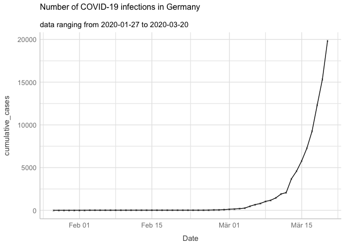
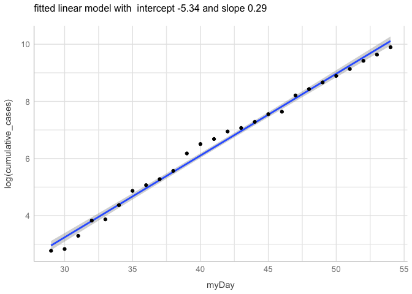

COVID-19 outbreak analysis in Germany with R
--------------------------------------------

The conducted analysis follows the posts by Tim Churches, starting with
his post in February 2020:
<a href="https://timchurches.github.io/blog/posts/2020-02-18-analysing-covid-19-2019-ncov-outbreak-data-with-r-part-1/#estimating-changes-in-the-effective-reproduction-number" class="uri">https://timchurches.github.io/blog/posts/2020-02-18-analysing-covid-19-2019-ncov-outbreak-data-with-r-part-1/#estimating-changes-in-the-effective-reproduction-number</a>

The code is slightly changed, some graphs are tweaked. All in all this
is supposed to help scientists as well as non-scientists to gain
insights and conduct their own analysis of the situation.

### Data Acquisition

Data are pulled from JHU Git Hub archive
<a href="https://raw.githubusercontent.com/CSSEGISandData/" class="uri">https://raw.githubusercontent.com/CSSEGISandData/</a>

### Implemented Features

A simple liner model is fit can easily be fitted to the log-transformed
data:

    myLinearModel = lm(log(cumulative_cases) ~ myDay,
                       datLong %>% 
                       filter(Date >= as.Date("2020-02-24")) 
                       )
    summary(myLinearModel)

    ## 
    ## Call:
    ## lm(formula = log(cumulative_cases) ~ myDay, data = datLong %>% 
    ##     filter(Date >= as.Date("2020-02-24")))
    ## 
    ## Residuals:
    ##      Min       1Q   Median       3Q      Max 
    ## -0.40969 -0.16772  0.01537  0.10461  0.40208 
    ## 
    ## Coefficients:
    ##              Estimate Std. Error t value Pr(>|t|)    
    ## (Intercept) -5.344006   0.223405  -23.92   <2e-16 ***
    ## myDay        0.286230   0.005297   54.03   <2e-16 ***
    ## ---
    ## Signif. codes:  0 '***' 0.001 '**' 0.01 '*' 0.05 '.' 0.1 ' ' 1
    ## 
    ## Residual standard error: 0.2026 on 24 degrees of freedom
    ## Multiple R-squared:  0.9918, Adjusted R-squared:  0.9915 
    ## F-statistic:  2919 on 1 and 24 DF,  p-value: < 2.2e-16

    ## `geom_smooth()` using formula 'y ~ x'

With a linear modell crude predictions can be made:

